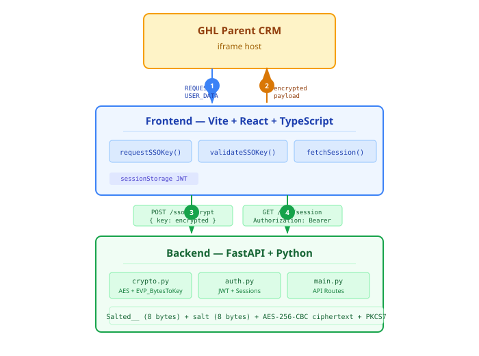

# GHL Custom Pages SSO Starter

A production-ready starter for implementing GoHighLevel Custom Pages SSO with a **Vite + React + TypeScript** frontend and **FastAPI** backend.

This starter implements the [Custom Pages postMessage flow](https://marketplace.gohighlevel.com/docs/other/user-context-marketplace-apps) with AES-256-CBC decryption (OpenSSL-compatible EVP_BytesToKey), JWT session management, and TypeScript interfaces for the GHL user context payload.

Companion blog post (architecture, implementation details, and production notes): [Building GoHighLevel Custom Pages SSO](https://winstonbrown.me/blog/ghl-custom-pages-sso-starter/)

> Built by [BigPeesh](https://bigpeesh.com), a scoped MCP server for safely connecting AI agents to CRM data with read-only defaults, granular permissions, audit logs, and revocable connection keys.

## Architecture



## Quick Start

### Backend

```bash
cd backend
python -m venv venv && source venv/bin/activate
pip install -r requirements.txt
cp .env.example .env
# Edit .env with your GHL Shared Secret
uvicorn app.main:app --reload --port 8000
```

### Frontend

```bash
cd frontend
npm install
cp .env.example .env
npm run dev
```

## Configuration

### GHL Shared Secret

1. Go to your GHL marketplace app's **Advanced Settings**
2. Navigate to the **Auth** section
3. Under **Shared Secret**, click **Generate**
4. Copy the key into your backend `.env` as `GHL_SHARED_SECRET`

### Environment Variables

**Backend** (`.env`):
| Variable | Description |
|---|---|
| `GHL_SHARED_SECRET` | Shared Secret from GHL app settings |
| `JWT_SECRET` | Secret for signing JWT tokens |
| `FRONTEND_URL` | Frontend origin for CORS (default: `http://localhost:5173`) |

**Frontend** (`.env`):
| Variable | Description |
|---|---|
| `VITE_API_BASE_URL` | Backend URL (default: `http://localhost:8000`) |

## Testing Without GHL

Use the included test script to generate encrypted payloads locally:

```bash
cd backend
node test-encrypt.js
# Copy the output and POST it to /sso/decrypt
```

## Security Notes

- All decryption happens server-side. The shared secret never touches the client.
- Use `sessionStorage` (not `localStorage`) for JWT storage. It clears when the tab closes.
- Enable postMessage origin validation in production (see `ssoService.ts`).
- Use HTTPS for the frontend-to-backend connection.
- Set short JWT expiration times to match GHL session lifecycle.

## License

MIT
